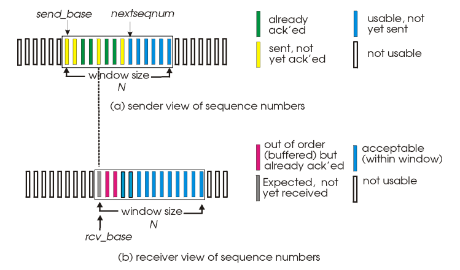
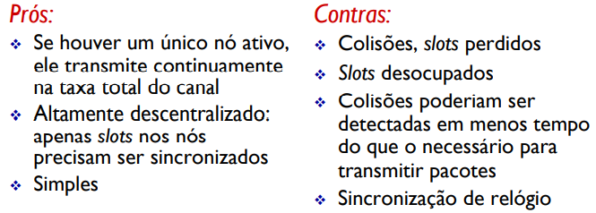

# Escape Redes

**Gustavo Donnini Chen,
guschen@usp.br**

## Tópicos a serem abordados:

1. Introdução
2. Rede de redes 
3. Modelo OSI, cabeçalhos
4. Camada 5: Aplicações de alto nível
5. Camada 4: Princípios de RDT
6. Camada 3: Comutação e roteamento
7. Camada 2: Atraso e vazão

## 1. Introdução

A disciplina de intro a redes foca em ensinar basicamente como funciona a "internet".

Podemos definir a internet como um conjunto de hardware e software com protocolos, roteadores, enlaces (fios), memórias, etc, assim como eles **definem nos slides da aula 1**. Porém, pra mim, a maneira mais simples de enxergar a internet é como um **serviço** (ou mais especificamente, um conjunto de serviços).

A internet é a responsável por fazer com que aquela mensagem que você mandou agora de pouco pra alguém no whats passe pela sua **rede de acesso (wi-fi, cabo de internet da sua casa, 3g) até seu roteador, depois percorra a borda da rede até chegar no núcleo, onde ela será roteada e comutada até chegar na rede local** da pessoa pra qual você ta mandando a mensagem.

Nessa disciplina vocês vão ver basicamente esse processo, junto com alguns protocolos e algoritmos que são usados pra garantir **controle e confiabilidade** pra essa sua conexão.

## 2. Rede de redes

Outra coisa que é bom ter noção é da magnitude das redes e das conexões entre elas.

**As empresas que vendem internet são chamadas de ISP's (Internet Service Provider)**. No Brasil, temos ISP's como Tim, Vivo, Claro. Cada ISP possui sua rede, e todas as ISP's são conectadas entre sí através de **enlaces de pareamento**. Além desses enlaces, existem também **redes regionais** que conectam várias redes de acesso entre sí e depois conecta esse bloco de redes de acesso a uma ISP, e os **IXP's (Internet Exchange Points)** que conectam redes de acesso entre sí e a ISP's globais.

  

## 3. Modelo TCP/IP

Como já deu pra ver na introdução, a internet é responsável por muitos serviços diferentes, sendo alguns desses serviços voltados pra controlar a ordem dos dados transmitidos, outros para garantir a confiabilidade dos dados, outros para modular o sinal transmitido no fio, outros pra definir o caminho que a informação percorrerá até o host destino, etc. É uma bagunça.

Como uma forma de simplificar a analise da internet como um todo, foi criado o modelo TCP/IP. Esse modelo separa a internet em 5 camadas numeradas de baixo pra cima. As camadas mais altas são de nível mais alto, e as mais baixas de nível mais baixo. É comum se referir a uma camada pelo seu número, e não pelo seu nome.

  

### Independência das camadas

Uma coisa muito importante de se entender é que **todas as camadas são independentes umas das outras**, ou seja, quando estudamos uma das camadas, podemos (e devemos) ignorar completamente o que as outras camadas fazem. Não devemos pensar em como uma camada interage com a outra, e sim no que cada uma das camadas faz sozinha.

### Cabeçalhos, camadas e encapsulamento

Cabeçalhos são informações que viajam junto com os pacotes anviados pela internet e que carregam informações meta sobre esse pacote. Qual o IP de origem desse pacote? E de detino? Qual o tamanho desse pacote? Entre os outros 3 pacotes com os quais ele foi enviado, ele é o primeiro, segundo, terceiro ou quarto na fila? Todas essas informações estão no cabeçalho de cada pacote.

Essas informações meta são utilizadas pelos protocolos de todas as camada para que possam realizar suas devidas funções corretamente. Porém, um pacote não "nasce" com todas essas informações. Veremos posteriormente que o envio de um pacote **se inicia na camada 5, e desce a pilha de protocolos até que alcance a camada 1**, onde pode ser enviado pelo enlace até o destino.

Assim, quando criamos uma nova requisição, devemos adicionar informações ao cabeçalho de forma sequencial **começando pelo cabeçalho da camada de transporte (4) (camada de aplicação (5) fornece a mensagem a ser enviada, mas não possui cabeçalho) e terminando no cabeçalho da camada de enlace (2) (camada física (1) não possui cabeçalho), sendo que os cabeçalhos que foram adicionados por último ficam no "topo" da mensagem**.

> Podemos imaginar o pacote como sendo um sorvetasso de cone. Quando surge a necessidade de enviar uma mensagem, adicionamos a primeira bola de sorvete (mensagem) no cone. Depois, adicionamos uma outra bola de sorvete (cabeçalho da camada 4) em cima da primeira, e assim por diante. Note que não podemos comer uma bola de sorvete que sustenta outras bolas de sorvete no nosso cone (se a comermos, cai o sorvete tudo).

Os cabeçalhos funcionam da mesma maneira. Não podemos remover o cabeçalho da camada 4 sem antes remover o da camada 3, por exemplo (os últimos ficam por cima). Quando o pacote chega no host destino, ele é processado de cima pra baixo, removendo os cabeçalhos um a um até chegar na mensagem.

A disciplina de redes estuda todas as 5 camadas. Porém, pra P1, estudaremos até a camada de enlace.

## 4. Camada de Aplicação (5)

A camada 1 é bem pouco estudada nessa disciplina, provavelmente por causa de sua complexidade. A camada 1 abriga todas as aplicações que existem na internet, assim sendo a camada com a qual interagimos sempre que queremos usar algum serviço da internet. Google Chrome, Spotify, Whatsapp, Clash Royale, são todos aplicações da camada 1. É nela que surgem as requisições e respostas de pacotes.

### P2P vs Cliente-servidor

Essa camada também define o tipo de **arquitetura** que será utilizada por determinada aplicação. Existem dois tipos de arquitetura: **Peer-to-peer (P2P) e Cliente-servidor**. 

- **Cliente-servidor:** Arquitetura mais comum. Essa arquitetura consiste, assim como seu nome diz, na interação entre cliente e servidor. O cliente é a pessoa que quer utilizar de algum serviço, e o servidor é o agente que oferece esse serviço. O servidor deve possuir um endereço fixo, e deve concentrar todas as requisições. Clientes não se comunicam com outros clientes diretamente.

    > Quando pesquisamos alguma coisa no google, mandamos uma requisição pra algum servidor da google. Esse servidor, por sua vez, responde a requisição com o resultado da pesquisa, que é apresentada em nosso navegador.
    
    > Quando acessamos o facebook, requisitamos as publicações que devem aparecer no nosso feed para algum servidor do facebook. Com a sua resposta, o app consegue te mostrar o conteúdo.
    
    > **Quando mandamos uma mensagem no whats, a mensagem é enviada para um servidor do whats e depois encaminhada para o usuário final. Serviços de mensagem usam essa arquitetura pois ela possibilita o envio de mensagens para uma pessoa que não está online no momento, coisa que não é possível na arquitetura P2P.**

- **P2P:** Essa arquitetura consiste na troca de informação entre vários peers. É como se todos os usuários do aplicativo que utiliza essa arquitetura fossem **ao mesmo tempo clientes e servidores**. Todo mundo faz requisição pra todo mundo, e todo mundo oferece serviço pra todo mundo.

    > Quando baixamos alguma coisa via torrent, estamos puxando uma parte do download de cada peer, e não puxando o arquivo inteiro de um único servidor.

  

### Conexões HTTP Persistentes vs Não persistentes

Um dos, se não o protocolo mais comum dessa camada é o HTTP. O protocolo HTTP é responsável por localizar e requisitar objetos de um determinado servidor. Quando digitamos algum endereço ou navegamos por sites da internet, muito provavelmente estamos usando o HTTP.

  

Atualmente, também temos o HTTPS, que utiliza uma camada intermediária entre a camada 5 e 4 chamada de SSL, que é responsável por criptografar seus dados antes de enviar suas requisições pra rede. Da pra ver o protocolo que você está utilizando no seu próprio navegador. É só olhar o endereço, e ele deve estar lá.

  

As conexões do protocolo HTTP usam o TCP como protocolo de camada 4, e podem se dar de duas maneiras:

  - **Conexão não persistente:** Durante uma conexão, um único objeto pode ser enviado. Uma única imagem, uma única mensagem, um único arquivo HTML ou o que for, mas só pode um. Nesse tipo de conexão, como da pra ver no exemplo abaixo, o tempo total entre a requisição da conexão e o momento que o cliente recebe o arquivo é:$$T_{np}=2RTT+\text{tempo de transmissão de arquivo}$$sendo RTT (Round-Trip Time) o tempo de uma requisição sair do cliente, chegar ao servidor e voltar para o cliente. Esse valor de tempo representa o envio de **um** arquivo. Para vários arquivos, teríamos que somar os valores dos $n$ tempos.
  

  > Caso desejássemos acessar um site com 10 imagens a partir de uma conexão não persistente, deveríamos requisitar o arquivo HTML, e depois requisitar individualmente cada uma das 10 imagens. Exemplo retirado dos slides da aula sobre camada de aplicação.
  > 
  

  > 
  
 

  - **Conexão persistente:** Agora, nossa conexão não se fecha depois da trasnmissão de um objeto. Isso faz com que o envio de vários arquivos seja muito mais rápida:$$T_{p}=RTT+n(\text{tempo de transmissão de arquivo})$$sendo $n$ a quantidade de arquivos.

## 5. Camada de Transporte (4)

A camada 4 é responsável por garantir a confiabilidade de dados (quando necessária) para os pacotes transmitidos na internet. **Ela garante essa confiabilidade a partir da utilização de protocolos de RDT - Reliable Data Transfer**. Existem diversos protocolos de RDT, sendo cada um voltado para um tipo de canal. Canais confiáveis (sem perdas de bit nem perda da ordem dos pacotes) utilizam um protocolo RDT, canais com perdas de bit mas sem perda da ordem dos pacotes utilizam outro, e assim por diante.

Ao utilizar esses protocolos de RDT, **transformamos um canal não confiável do ponto de vista das camadas superiores em um canal confiável**. É como se estivéssemos enviando uma carta pelo correio. Você, camada superior, deposita sua carta e simplesmente acredita que ela vai chegar no destino, enquanto os correios (camadas inferiores) se encarregam do resto. Aqui podemos começar a visualizar aquele conceito de independência entre as camadas.

### Funcionamento dos protocolos

Para explicar os protocolos, utilizaremos máquinas de estado. **As bolotas representam os estados, as setas representam as transições de estados e os textos vinculados às setas representam as condições necessárias para essa transição de estados acontecer.** Nos slides, eles também usam uma pseudo linguagem horrivel. Tentarei explicar sem usar essa linguagem.

Vale ressaltar que esses protocolos RDT não são reais, e sim representações didáticas da resolução de problemas reais.

Os protocolos RDT atuam tanto no emissor da mensagem quanto no receptor, tendo uma função diferente em cada situação.

### RDT 1.0

Primeiro, vamos considerar uma situação onde estamos utilizando um **canal confiável**. Isso não existe na prática, mas é bom pra começarmos a entender o funcionamento do RDT. Chamaremos de RDT 1.0 o protocolo RDT utilizado em situações como essa.

Como não precisamos nos preocupar com perda de pacotes nem com a ordem dos pacotes, a única coisa que o RDT 1.0 deve fazer é literalmente encaminhar os pacotes.

> **No emissor**, o RDT 1.0 deve pega os dados recebidos da camada 5, empacotá-los e enviá-los para as camadas inferiores, que levarão o pacote até o receptor. **No receptor**, o RDT 1.0 deve pegar o pacote recebido das camadas inferiores, desempacotá-lo e enviá-lo para a camada 5.

  
 

### RDT 2.0

Agora vamos considerar que nosso canal tem **perdas de bit**, mas não tem perda de pacotes inteiros. O máximo que pode acontecer é um pacote ser corrompido, mas sempre vai chegar alguma coisa no receptor. Como o RDT 2.0 garantirá que todos os pacotes serão transmitidos sem erros se o canal pode corromper os pacotes a qualquer momento?

A resposta desse problema se baseia em **dois mecanismos: verificação de erros e acknowledgements (ACKs)**.

> **O emissor** pega os dados recebidos da camada 5, os empacota, os envia para as camadas inferiores **e fica esperando pela resposta do receptor**. **No receptor**, o RDT 2.0 utilizará alguma técnica de verificação de erro para ver se o pacote chegou ou não inteiro. Se tiver **chego inteiro, o receptor responde o emissor com um ACK**, desempacota o pacote e encaminha a informação para as camadas superiores. Caso tenha **chego com erros, o receptor responde o emissor com um NACK** (not ack). De volta no emissor, caso receba um ACK, ele fica ciente de que o receptor recebeu o pacote sem erros e envia o próximo pacote. Caso receba um NACK, ele fica ciente de que o receptor recebeu um pacote com erro, reenvia esse mesmo pacote e volta a esperar por uma resposta.

  
 

Eles também mostram RDT 2.1 e 2.2, mas o importante é entender o RDT 2.0.

### RDT 3.0

Por fim, vamos considerar que nosso canal tem **perdas de bit e perda de pacotes**. Além de garantir que o pacote recebido pelo receptor esteja sem erros, precisamos considerar as situações onde simplesmente não chega nada no receptor e onde os ACKs e NACKs se perdem.

Para lidar com esse tipo de situação, podemos definir um **tempo de timeout (t.o.)** para os pacotes. Porém, a introdução desse tempo de t.o. acaba trazendo outros problemas. Imagine uma situação onde o emissor manda um pacote para o receptor, o receptor recebe o pacote e manda um ACK como resposta, mas esse ACK acaba pegando uma rota com tráfego alto, e chega atrasado no emissor. Quando o emissor receber esse ACK, ele já vai ter reenviado o pacote correspondente a esse ACK, gerando uma **duplicata no receptor**. Para evitar que isso aconteça, é introduzido um número sequencial nos pacotes. Com ele, quando acontecer a situação que acabamos de analisar, o receptor conseguirá identificar que recebeu um pacote duplicado e descartar a duplicata, assim não gerando problemas na mensagem original.

> O emissor empacota os dados recebidos da camada superior com um número sequencial, envia o pacote e dispara um contador que conta até esse determinado tempo de t.o. (que normalmente é o próprio tempo de RTT). Caso ele (o emissor) não receba nenhuma resposta correspondente a esse número sequencial até o final da contagem, ele assume que o pacote se perdeu e o reenvia, reiniciando a contagem do t.o. O emissor se comporta basicamente da mesma maneira que o do RDT 2.0, porém agora ele verifica o número sequencial dos pacotes recebidos para ver se não está recebendo uma duplicata e envia ACKs e NACKs com os números sequenciais referentes ao pacote que estão respondendo. É mais fácil de entender olhando os exemplos.

  
 

  
 

### RDT 3.0: Desempenho

Analisando o desempenho desse algoritmo, podemos ver que ele é péssimo. Algumas fórmular importantes para essa análise são:

$$d_{trans}=\frac{L}{R}$$

sendo L o tamanho do pacote e R a velocidade do enlace. $d_{trans}$ mede o atraso de transmissão.

$$U_{trans}=\frac{\frac{L}{R}}{RTT+\frac{L}{R}}$$

$U_{trans}$ mede a fração do tempo que o transmissor fica ocupado enviando dados.

Se fizéssemos as contas, veríamos que $U_{trans}$ é muito baixo, ou seja, o emissor fica muito tempo sem fazer nada. **Para corrigir isso, podemos utilizar técnicas de pipelining**, ou seja, enviar diversos pacotes de uma vez e esperar a resposta de todos eles na sequência. Dessa forma conseguimos utilizar melhor o tempo do transmissor e a banda do enlace.

Como serão vários pacotes viajando de uma só vez, devem existir buffers no transmissor e/ou no receptor para que possamos realizar o controle de erros. O emissor e o receptor receberão vários pacotes de uma vez, tornando necessária a existência de alguma estrutura que armazene os pacotes temporariamente.

Na prova, muito provavelmente vai ter um exercício sobre um dos seguintes tópicos:

### Go-back-N (GBN)

O jeito mais fácil de entender seu funcionamento é com um exemplo. 

  

Tanto o GBN quanto o Repetição seletiva são protocolos de _sliding window_ ou janela deslizante. Isso significa que o controle do envio dos pacotes é feito através de uma janela transmissora com uma janela de $N$ pacotes. **Esse valor $N$ representa a quantidade de pacotes que podem ser enviados sem que haja nenhuma confirmação**.

O protocolo GBN não tem quantidade mínima de números sequenciais para que funcione corretamente.

Além disso, o receptor produz **ACKs acomulativos, ou seja, sempre responde com o ACK do último pacote que foi recebido na ordem correta**. 

Por último, é importante ressaltar que **esse protocolo utiliza somente um timer para contar o tempo de timeout**, sendo que esse timer sempre fica vinculado com o pacote mais antigo que ainda não foi confirmado.

Definida a janela, podemos começar a enviar os pacotes. Seguindo o exemplo, acontece o seguinte (não exatamente nessa ordem): 

1. Transmissor envia a janela inicial de pacotes 0, 1, 2 e 3
2. Pacotes 0 e 1 chegam corretamente no receptor, que devolve os ACKs 0 e 1.
    - Reparem que todos os pacotes demoram 1 RTT para irem e voltarem. É bom fazer esse desenho pra ver a ordem que as coisas acontecem.
3. Pacote 2 se perde no envio, não produzindo o ACK 2.
4. Receptor **recebe pacote 3 e devolve ACK 1**.
    - Como o receptor não recebeu o pacote 2 e produz ACKs acumumlativos, ele responderá com o último pacote recebido na ordem correta, que é o pacote 1.
5. ACK 0 chega no transmissor.
    - Nesse ponto, a janela de transmissão **desliza** até depois do último ACK recebido. No caso, ela avança para a posição 1.
    - **Como o receptor nunca envia ACKs fora de ordem (nunca envia um ACK 2 sem antes ter enviado o ACK 1), a janela sempre se deslocará uma casa por vez.**
6. Transmissor envia pacote 4
    - Pois agora a janela engloba um pacote que ainda não foi enviado.
7. ACK 1 chega no trasmissor
    - Janela se desloca
8. Transmissor envia pacote 5
9. Transmissor recebe ACK 1 repetido (resposta ao pacote 3) e o ignora por ser um ACK repetido.
10. Pacote 2 sofre timeout, **transmissor reenvia a janela inteira**.
    - Como vimos anteriormente, o timer para t.o. se inicia no envio do pacote e conta o tempo de t.o.. Como transmissor não recebeu resposta nesse tempo, ele reenvia a mensagem. **Como estamos utilizando o GBN, a janela inteira é reenviada**.
11. Demais pacotes são enviados normalmente.

Exercícios desse tipo normalmente fornece o RTT e pergunta quanto tempo demora pro último pacote chegar no receptor. Com o diagrama montado é fácil encontrar esse tempo, bastando contar quantos RTTs aconteceram desde o envio do primeiro pacote até a chegada do último.

> Exercício 11 da lista

### Repetição seletiva

Esse algoritmo funciona de maneira bem semelhante ao GBN. A idéia geral é a mesma, mas existem duas diferenças:

1. O **transmissor E o receptor possuem janelas de transmissão**, sendo que elas nem sempre precisam estar sincronizadas. 
  
 A janela do transmissor avança quando ele recebe um ACK, enquanto a janela do receptor avança quando ele recebe um pacote.

2. Como consequência da primeira diferença, o **receptor pode responder ACKs para pacotes fora de sequência** e as janelas de transmissão tanto do transmissor quanto do receptor **podem se deslocar mais de uma casa por vez, realizando saltos**. 

A quantidade de números sequenciais (no exemplo, de 0 até 8) mínima para que o protocolo Repetição seletiva funcione corretamente é o dobro do valor de $N$, mas só usem essa quantidade caso o exercício não a especifique.

Vamos analisar a mesma situação que analisamos no caso do GBN.

  

Nesse caso, teríamos o seguinte:

1. Transmissor envia a janela inicial de pacotes 0, 1, 2 e 3
2. Pacotes 0, 1 **e 3** chegam corretamente no receptor, que devolve os ACKs 0, 1 **e 3**.
    - Nesse ponto, a janela de transmissão **do receptor** desliza **duas** posições e **marca como recebido o pacote 3**, adicionando-o ao buffer. Nessa situação, o pacote 2 está "travando" a janela. 
3. Pacote 2 se perde no envio, não produzindo o ACK 2.
4. ACKs 0, 1 e 3 chegam no transmissor.
    - Nesse ponto, a janela de transmissão do **transmissor** se sincroniza com a do receptor deslizando duas posições, marcando o pacote 3 como "enviado corretamente" e "travando" a janela no pacote 2.
5. Transmissor envia pacotes 4 e 5
    - Pois agora a janela engloba esses pacotes que ainda não foi enviado.
6. Pacotes 4 e 5 chegam no receptor e produzem ACKs 4 e 5.
    - Janela do receptor **não** se desloca pois ainda está sendo travada pelo pacote 2, mas marca os pacotes 4 e 5 como recebidos corretamente e os adiciona ao buffer.
7. Pacote 2 sofre t.o. e é reenviado.
    - **Na repetição seletiva é reenviado somente o pacote com erro, e não a janela inteira.**
8. Transmissor recebe ACKs 4 e 5.
    - Janela ainda não se desloca pois ainda está sendo travada pelo pacote 2.
    - Como a janela não se desloca e todos os pacotes dentro da janela já foram enviados, o transmissor fica sem fazer nada.
9. Receptor recebe o pacote 2 e gera o ACK 2.
10. Transmissor recebe o ACK 2.
    - Ao receber o ACK 2, a janela do transmissor deixa de ser "travada" e verifica quantas posições ela deve deslizar. Como os pacotes 3, 4 e 5 já foram enviados, a janela **pula** para a posição 6. Esse pulo nunca aconteceria no GBN.

## GBN vs Repetição seletiva

  

### TCP e UDP

Tendo toda essa base de RDT, já sabemos como a camada 4 transforma um canal não confiável em um confiável. Agora, vamos ver rapidamente os 2 principais protocolos (reais, dessa vez) utilizados pela camada 4. Ambos fazem exatamente o que vimos até agora: pegam informação da camada superior, a empacotam e enviam para as camadas inferiores para que chegue no receptor.

- **UDP (User Datagram Protocol):** Protocolo que realiza esse serviço mas sem confiabilidade, ou seja, não implementa nenhum dos mecanismos de RDT. Além disso, ele **não cria uma conexão, simplesmente enviando os pacotes para o receptor sem antes avisar que vai enviar informações**. Pode acontecer do receptor estar ocupado e não receber nenhum dos pacotes enviados, por exemplo. Sua vantagem está na velocidade, que é muito maior do que a do TCP.

- **TCP (Transmission Control Protocol):** Protocolo que utiliza dos mecanismos de RDT para estabelecer uma conexão confiável. Ele também **cria uma conexão com o receptor antes de enviar os pacotes**, avisando previamente que deseja o enviar pacotes e assim garantindo que o receptor não estará ocupado no momento que enviar a informação. O TCP utiliza uma mistura do GBN com o RS:
    - Timer único (GBN)
    - Retransmite somente o pacote que causou timeout (RS)
    - ACKs acumulativos (GBN)
    - Janela de transmissão pode "pular" várias posições (RS)
    
    podemos ver melhor seu funcionamento com um exemplo. Não vou passar passo a passo, pois entendendo o GBN e o RS, fica fácil entender o que acontece aqui. **Esse exemplo considera que o receptor possui buffers. Caso ele não possuisse, o receptor descartaria todos os pacotes que aqui foram adicionados no buffer.** Pensando nesse exemplo, seria enviado o ACK 2 ao invés do ACK 5 no final.

    
  

### Definição do RTT

O último tópico da camada 4 é a definição do cálculo do RTT segundo o TCP. Essa definição é importante pois o RTT é utilizado para calcular o tempo de timeout. Se considerarmos um RTT muito curto, muitos pacotes sofreriam timeout desnecessariamente. Se ele for muito longo, o emissor ficaria muito tempo esperando pelo t.o. As fórmulas são as seguintes:

- $EstimatedRTT(t)=(1-\alpha).EstimatedRTT(t-1)+\alpha.SampleRTT(t)$
- $DevRTT(t)=(1-\beta).DevRTT(t-1)+\beta . |SampleRTT(t)-EstimatedRTT(t)|$
- $TimeoutInterval(t)=EstimatedRTT(t)+4.DevRTT(t)$

Essas fórmulas representam $t$ como um atributo contínuo, mas na verdade ele só indica o pacote ao qual estamos no referindo. $t$ é o pacote atual e $t-1$ é o último pacote enviado.

## Camada de Rede (3)

A camada 3 é a responsável por **rotear e repassar (comutar) os pacotes pela internet**.

- **Roteamento:** **Determinar o caminho completo que um determinado pacote percorrerá entre o host inicial e o host destino**. Podemos imaginar como sendo a rota que o google maps traça entre o seu endereço atual e o endereço destino que você colocou lá. O roteamento aconteçe através de algoritmos de roteamento, que são programas que são rodados nos roteadores e que analisam o tráfego atual da rede e determinam a melhor rota até o destino.

- **Repasse:** Trabalho realizado por todos os roteadores da camada 3. **Consiste basicamente em pegar um pacote que chega na entrada desse roteador e encaminhá-lo para a saída adequada, garantindo que esse pacote percorra a rota definida pelo roteamento**.

Esses dois serviços trabalham em conjunto para levar todos os pacotes da internet de um lugar para outro.

### Atraso e vazão

Outro tópico que com certeza vai cair na prova. É um assunto que pode ser meio confuso num primeiro momento, mas é bem fácil de pegar o jeito.

Os roteadores da camada 3 utilizam a técnica de **store-and-forward** na transmissão dos pacotes. Isso significa em termos práticos que quando um pacote é enviado, **ele precisa ser entregue por inteiro à rede antes que um novo pacote possa ser inserido na rede**. Como todos os pacotes serão chaveados e processados dentro do roteador e depois terão que ser reintroduzidos no enlace, acaba surgindo um **atraso** na entrega dos pacotes. Esse atraso é composto por:

  

$$d_{nodal}=d_{processamento}+d_{fila}+d_{transmissão}+d_{propagação}$$

- $d_{nodal}$ se refere ao atraso total criado pelo node (roteador)
- $d_{processamento}$ é o tempo que o roteador gasta para realizar a verificação de erros no pacote e decidir para que enlace esse pacote deve ser redirecionado
    - Dado do exercício
- $d_{fila}$ é o tempo que esse pacote ficará na fila esperando para entrar no enlace
    - Esse delay surge quando o roteador tem que enviar muitos pacotes para um mesmo enlace de saída de uma única vez. Quando o volume de pacotes é maior do que a vazão, os pacotes formam uma fila para serem enviados.
    - Dado do exercício
- $d_{transmissão}$ é o tempo que os pacotes demoram para serem reintroduzidos na rede após sairem do roteador
    - Genericamente, $\frac{L}{R}$
    - $L$ é o tamanho do pacote
    - $R$ é a velocidade do enlace
- $d_{propagação}$ é o tempo que os pacotes (ou melhor, o sinal dos pacotes) demoram para percorrer o fio.
    - $d_{prop}=\frac{s}{v}$, muitas vezes é dado do exercício
    - $s$ é o comprimento do enlace físico
    - $v$ é a velocidade de propagação do meio

### Cálculo de $d_{nodal}$

O propósito de exercícios desse tipo é calcular o atraso nodal. Acho que eles apresentam algumas fórmulas nos slides, mas pra mim é mais fácil desenhar um diagramazinho com os tempos. Vou mostrar um exemplo com o próprio exercício da lista:

  

  

Do enunciado, $d_{prop}=20\mu s$ e $d_{proc}=35\mu s$. Como não temos informação sobre tempos de fila, vamos o considerar nulo. Além disso, $L=10000$ para o exercício A e $5000$ para o B, e $R=100Mbps$.

Para o exercício A, devemos simplesmente analisar o caminho que o pacote percorrerá. No caso, o caminho é o seguinte:

1. A insere Pct no primeiro enlace
2. Pct propaga até S
3. S processa Pct
4. S insere Pct no segundo enlace
5. Pct propaga até B

E podemos representar isso no seguinte diagrama:

  

Somando tudo, temos $275\mu s$.

Para o exercício B, teremos quase a mesma coisa. A diferença é que existem dois pacotes de tamanho menor. Nesse caso, seguindo o procedimento de store-and-forward, teremos o seguinte:

  

O último pacote demora $225\mu$ para chegar em B.

Reparem que **os pacotes demoram mais pra serem inseridos e percorrerem o enlace do que sendo processados no roteador**, e por isso nenhuma fila é formada. Caso houvesse fila, os pacotes ficariam um tempo parados em S esperando para serem inseridos no segundo enlace.

### Endereços IP

Assim como vimos antes, o propósito da camada 3 é **rotear e repassar** pacotes através da rede.

Podemos imaginar esse problema como o envio de uma carta. Imagine que você escreveu uma carta e deseja a enviar para um conhecido seu. O jeito mais simples de resolver isso é **escrevendo o endereço do seu conhecido na carta** e a depositar num dos coisos dos correios.

A camada 3 faz algo semelhante a isso. Para que possamos enviar paotes pra alguém, precisamos antes ter seu endereço: **o endereço IP**.

**O endereço IPv4 é composto por 32 bits ou por 4 números decimais de 0 a 255 separados por um ponto.**

  

### CIDR e sub-redes

Podemos entender sub-redes como uma maneira de organizar e distribuir endereços IP. **De forma prática, conseguimos identificar uma sub-rede e todos os hosts pertencentes a ela através do endereço IP em notação CIDR (Classless InterDomain Routing) dessa subrede**. Essa notação divide o endereço IP em duas partes, sendo uma o identificador da sub-rede e a outra o identificador dos hosts.

Separamos essas duas partes através de uma máscara, que é representada por um /XX no final do endereço IP. **Esse /XX indica a quantidade de bits que representam o identificador da sub-rede, sendo que começamos a contar esses bits pelos mais significativos (mais a esquerda)**.

Por exemplo, no endereço 255.255.56.1/20, teremos o seguinte:

$$\overbrace{1111 1111}^{255}. \overbrace{1111 1111}^{255}. \overbrace{0011 1000}^{56}. \overbrace{0000 0001}^{1}$$

$$\underbrace{1111 1111. 1111 1111. 0011}_{sub-rede} \underbrace{1000. 0000 0001}_{host}$$

Utilizamos isso principalmente para projetos de redes. Cada identificador de sub-rede deve ser único, e cada identificador de host deve ser único para uma determinada sub-rede.

### Esgotamento de endereços IPv4, NAT e IPv6

Por ser formado por uma palavra de 32 bits, temos um total de $2^{32}$ endereços IPv4 disponíveis. É bastante, mas não é suficiente para a quantidade de aparelhos e redes que utilizamos atualmente. Esses endereços se esgotaram alguns anos atrás e duas soluções emergiram nesse período, uma paliativa e uma permanente. 

- **Paliativa - NAT (Network Address Translation):** Idealmente, cada aparelho deve ter um endereço IP único para que ele possa ser identificado na rede. Porém, com a introdução do NAT, um único endereço IP passou a ser "multiplexado" entre vários dispositivos. Cada aparalho na sua casa possui um endereço NAT, e o roteador NAT se encarrega de realizar a tradução dos endereços IP reais para os endereços NAT.

  

- **Permanente: IPv6:** O IPv6 é um novo formato de endereço IP (já utilizado, inclusive) composto por 128 bits ou 16 bytes. Agora, teremos $2^{128}$ endereços disponíveis, quantidade mais do que suficiente para dar um endereço para cada aparelho em uma rede local, tornando o NAT obsoleto. Mesmo sendo uma quantidade de endereços ABSURDAMENTE grande, nada garante que as futuras aplicações de redes não consumirão todos esses endereços. Além disso, o IPv6 alterou o formato dos cabeçalhos dos pacotes, otimizando algumas coisas que não eram muito boas no IPv4.

## Camada de Enlace (2)

A função da camada 2 é controlar a transferência de informações entre elementos vizinhos na rede, ou seja, entre um roteador e o próximo roteador do caminho, ou entre o host e o primeiro roteador da rota. A camada 2 também é responsável por encapsular os datagramas (pacotes da camada 3) em quadros (pacotes da camada 2), por algumas detecções e correções de erros e principalmente por **controlar o acesso compartilhado dos enlaces**. 

### Protocolos MAC (Medium Access Control)

Protocolos MAC são os protocolos que controlam o acesso compartilhado dos enlaces. Eles evitam que hajam 2 ou mais transmissões simultâneas, que resultam em interferências e colisões.

Esses protocolos estão divididos em 3 categorias:

- **Particionamento de canal:** São os protocolos mais básicos.
    - **TDMA (Time Division Multiple Access):** Cada nó recebe um slot de tempo. Cada slot de tempo consegue transmitir um pacote. Nó é livre para transmitir pacotes dentro de seu slot. Slots não usados ficam desocupados.
    - **FDMA (Frequency Division Multiple Access):** Cada nó recebe uma faixa de frequência. Se estivéssemos usando uma fibra óptica, cada nó receberia uma cor de luz. Faixas de frequência não usadas ficam descoupadas.

> Vantagens e desvantagens (R = taxa de transmissão do enlace, M = quantidade de nós desejando transmitir informação):
> 
  

- **Acesso aleatório:** Esses protocolos tem esse nome pois utilizam da aleatoriedade para evitarem colisões.
    - **Slotted ALOHA (Additive Links On-line Hawaii Area):** O tempo é dividido em slots de $\frac{L}{R}$ segundos. Os nós começam a transmitir no início de cada slot (todos os nós são sincronizados). **Se dois ou mais nós transmitirem no mesmo slot, todos os nós são notificados da colisão e os nós que geraram a colisão tem que retransmitir seus pacotes depois de um número aleatório de slots**.

    > 
  

  A eficiência ($E$) mede a fração de slots bem sucedidos.
    > Sendo G o número médio de tentativas de transmissão ou retransmissão em um dado instante, N o número de nós e p a probabilidade de transmissão ou retransmissão:
  $$p=\frac{G}{N}$$
  $$P[\text{um nó tenha sucesso em um slot}]=p(1-p)^{N-1}$$
  $$E = Np(1-p)^{N-1}=G(1-\frac{G}{N})^{N-1}$$
  $$\text{E máxima é alcançada quando G=1}$$
  $$\text{Quando N tende a infinito: } E_{max}=\frac{1}{e}$$

    - **ALOHA Puro (sem slots):** Sem sincronização entre os nós, mais simples. Como não existem slots, é como se fosse um slotted aloha num espaço contínuo. Nós tentam transmitir a qualquer momento e caso aconteça uma colisão, os nós esperam uma quantidade aleatória de **tempo** (não mais uma quantidade aleatória de slots) e tentam retransmitir. Isso faz com que a probabilidade de colisão aumente.

    > Usando as mesmas suposições:
  $$P[\text{um nó tenha sucesso em um slot}]=Np(1-p)^{2(N-1)}$$
  $$E = G(1-\frac{G}{N})^{2(N-1)}$$
  $$\text{E máxima é alcançada quando } G=\frac{N}{2N-1}$$
  $$\text{Quando N tende a infinito: } E_{max}=\frac{1}{2e}$$

    - **CSMA (Carrier Sense Multiple Access):** É um protocolo que representa uma conversa humana. O CSMA escuta o canal antes de transmitir. Existem dois tipos:
    - **CSMA/CA (Collision Avoidance):** Caso algum nó esteja transmitindo, ele espera o fim da transmissão para transmitir sua informação. Caso nenhum nó esteja transmitindo, ele transmite. Usado em enlaces sem fio.
    - **CSMA/CD (Collision Detection)** CSMA/CA + Caso dois nós transmitam ao mesmo tempo, ambos param de transmitir. Usado em enlaces cabeados.

    > Sendo dprop o máximo atraso de propagação entre 2 nós da rede local (LAN) e dtrans o tempo para transmitir quadros de máximo comprimento:

  $$E_{max}=\frac{1}{1+5\frac{d_{prop}}{d_{trans}}}$$

- **Revezamento:** Tentam juntar as melhores características do particionamento de canal e do acesso aleatório. 
    - **Protocolos de seleção:** Conxões são controladas por um "nó mestre", que convida os "nós subordinados" a estabelecerem as conexões.
    - **Protocolos de permissão:** Token de controle passado de um nó para o seguinte sequencialmente.

### Switches Ethernet: Comutadores da camada 2

Exercício.

